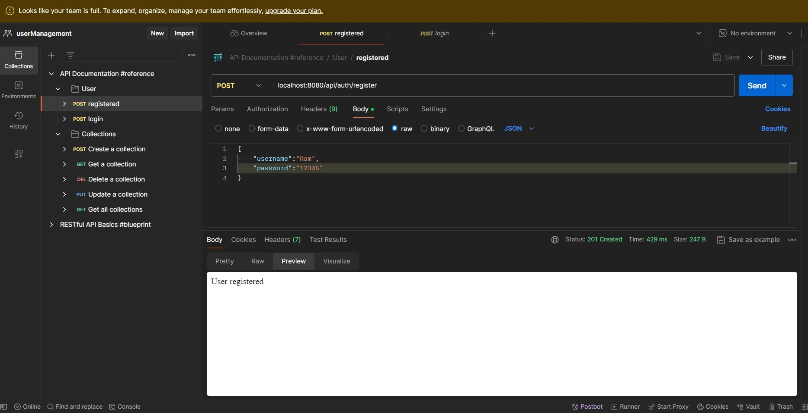
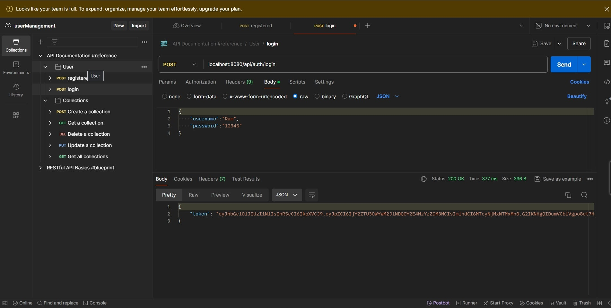
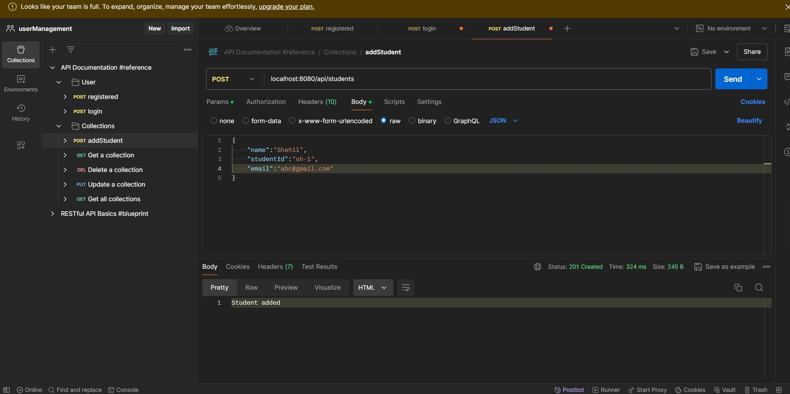
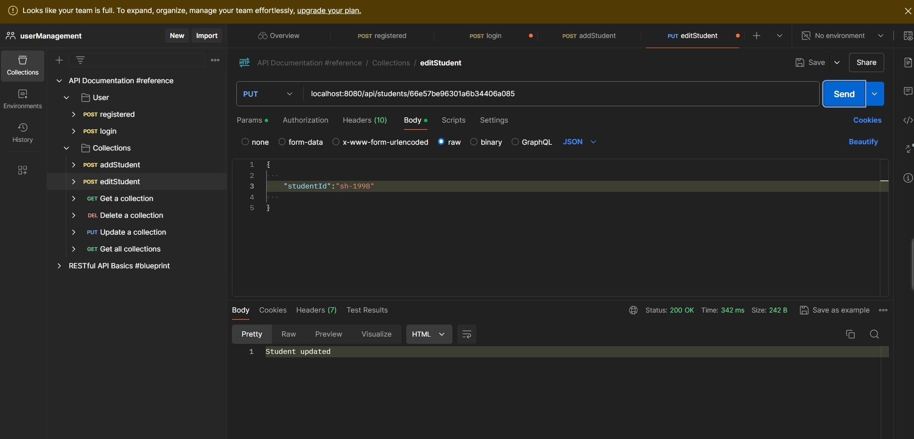
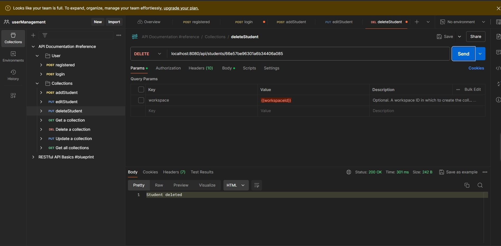
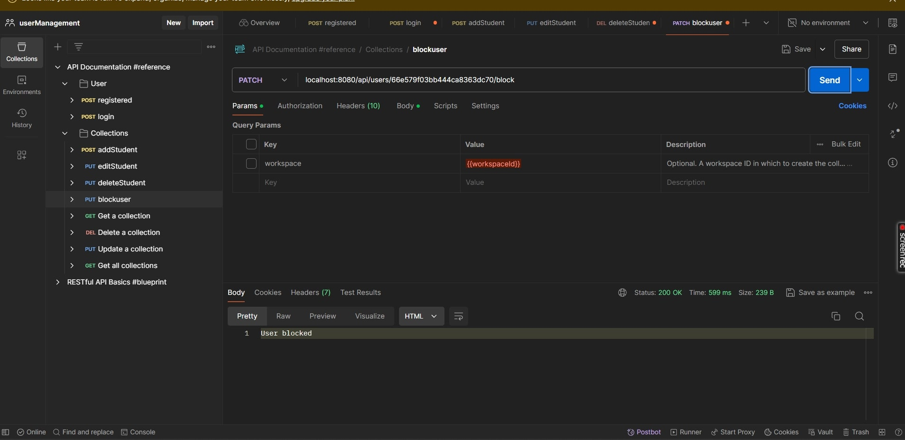
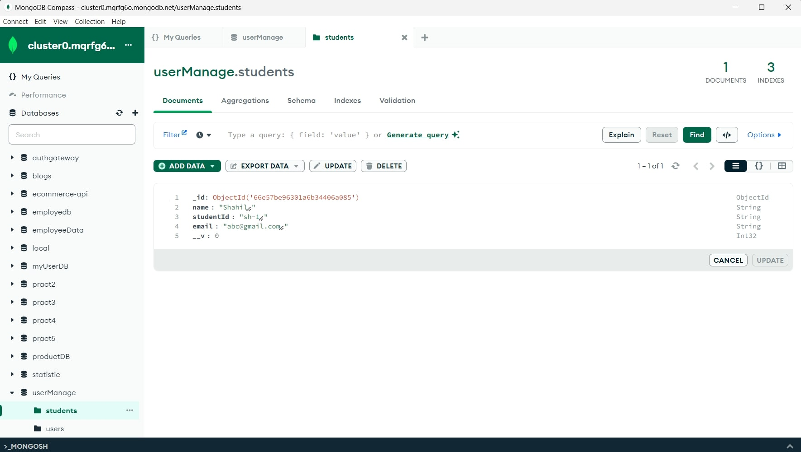

# User Management API

### Description

- Sign Up  User.
- Sign In User.
- Add Student.
- Edit Student.
- Delete Student.
- Block/Unblock User


## API Reference
#### URL= http://localhost:8080 (for Local )

#### Resitered User

```http
  POST /api/auth/register
```

| Body (application/json) | Type     | Description   |
| :---------------------- | :------- | :------------ |
| `username`              | `string` | **Required**. |
| `password`              | `string` | **Password**. |

#### Login

```http
  POST/api/auth/login
```

| Parameter  | Type     | Description   |
| :--------- | :------- | :------------ |
| `username` | `string` | **Required**. |
| `password` | `string` | **Required**. |

#### Add Student

```http
  POST/api/students
```

| Parameter  | Type     | Description   |
| :--------- | :------- | :------------ |
| `name` | `string` | **Required**. |
| `studentId` | `string` | **Required**. |
| `email` | `string` | **Required**. |

#### Update Student

```http
  put /api/students/:id
```

parameters        |  params                    | Type       | Description   |
|:-----------| :------------------------- | :-------   | :-----------  | 
   `body`          | `id`                       | `ObjectId`   | **Required**. |

#### Delete Student
```http
  delete /api/students/:id
```

|  params                    | Type       | Description   |
| :------------------------- | :-------   | :-----------  | 
| `id`                       | `ObjectId`   | **Required**. |

#### Block/Unblock User

```http
  patch /api/users/:id/block
```

| Parameter | Type       | Description   |
| :-------- | :--------- | :------------ |
| `id`     | `ObjectId` | **Required**. |


## Environment Variables

To run this project locally, you will need to add the following environment variables to your .env file created in root directory of your project
- DB_URL
- JWT_SECRET
- PORT

#### Note: Also, you will need to update proxy in package.json of react app by localhost:${port_number}

### Register User


### Login User


### Add Student


### Edit Student


### Delete Student


### Block/Unblock Student


### DB Collections




